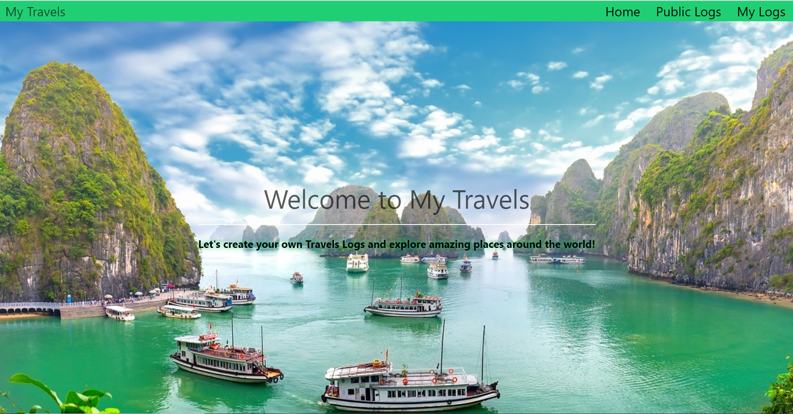
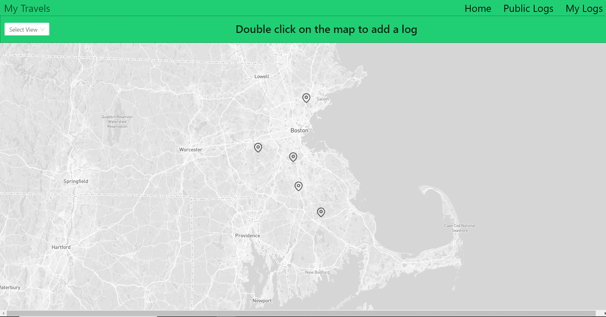
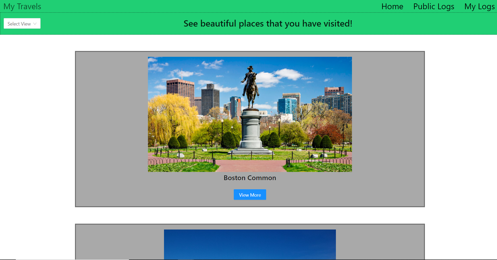

# My Travels App

Live: https://hanguyen-mytravels.now.sh/

This is a Travel Logs App that help users to saved all the travel logs they created. And also alow them to view other people travel logs. Users can see all the logs in form of Map View or List View.

### API Documentation: 

- ##### GET /api/logs

    Return all logs created

###### Example response

    [
        {
            id: 1,
            latitude: '42.3554',
            longitude: '-71.0640',
            title: 'Boston Common',
            description: 'This is a beautiful place',
            image: 'https://en.wikipedia.org/wiki/File:Aerial_View_Parkman_Bandstand_at_Boston_Common.jpg',
            rating: 10,
            visited_day: '2020-03-18T07:55:12.825Z',
            public: false,
            date_created: '2020-03-18T07:55:12.825Z',
        },
        {
            id: 2,
            latitude: '48.8584',
            longitude: '2.2945',
            title: 'Eiffel Tower',
            description: 'The tower is so tall',
            image: 'https://upload.wikimedia.org/wikipedia/commons/8/85/Tour_Eiffel_Wikimedia_Commons_%28cropped%29.jpg',
            rating: 10,
            visited_day: '2020-03-18T07:55:12.825Z',
            public: true,
            date_created: '2020-03-18T07:55:12.825Z'
        },
    ]

- ##### GET /api/logs/${logId}

    Return a log with a specific id

- ##### POST /api/logs
   
    Post a log

###### Example request

    {
        latitude: '48.8584',
        longitude: '2.2945',
        title: 'Eiffel Tower',
        description: 'The tower is so tall',
        image: 'https://upload.wikimedia.org/wikipedia/commons/8/85/Tour_Eiffel_Wikimedia_Commons_%28cropped%29.jpg',
        rating: 10,
        visited_day: '2020-03-18T07:55:12.825Z',
        public: true,
    }

- ##### DELETE /api/logs/${logId}

    Delete a Log. If no log could be found by logId , the server responds with a status 400.

### Preview:

Landing Page

Map View Page

List View Page

### Tech Stack

    Front-end: HTML, CSS, Javascript, React

    Back-end: Node.js, Express, PostgresSQL
